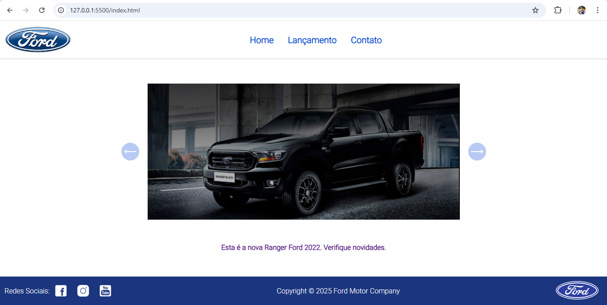
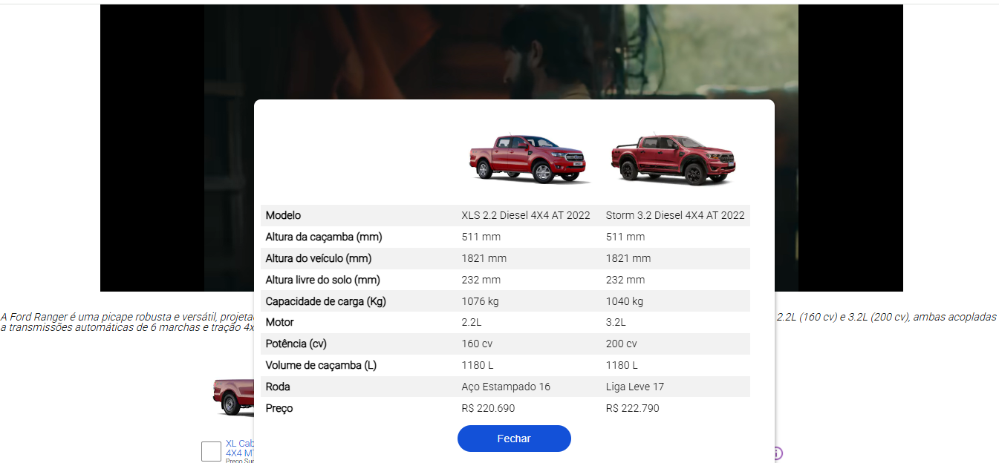
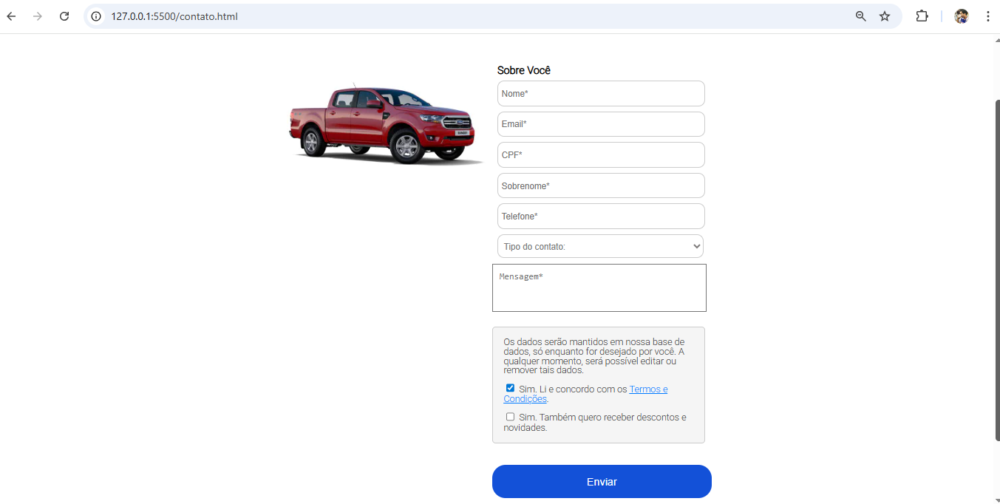

# 🚗 Projeto - Site de Lançamento de Carros

Este é um site simples desenvolvido com **HTML5, CSS3 e JavaScript**, utilizando **HTML semântico** para estruturar as páginas de forma acessível e organizada.

O projeto contém páginas de apresentação de veículos, comparação de modelos e formulário de contato com base na **LGPD**.

---

## 📑 Estrutura do Site

* **Header** → Cabeçalho com menu de navegação.
* **Main** → Conteúdo principal de cada página.
* **Footer** → Rodapé com informações adicionais.

---

## 🖥️ Páginas Criadas

### 🔹 Página Inicial

* Contém um **carrossel** que direciona para outras páginas do site.

📸 *Print da página inicial:*


---

### 🔹 Lançamento de Carros

* Exibe um **vídeo** apresentando o lançamento de um carro.
* Inclui uma **tabela de comparação** entre veículos:

  * É possível selecionar **dois veículos** para comparação.
  * Caso o usuário marque apenas **um veículo**, aparece uma **mensagem de erro** informando que é necessário escolher dois.
  * Caso o usuário marque **três veículos**, também aparece uma **mensagem de erro**, pois só é permitido comparar dois modelos por vez.

📸 *Print da página de lançamento:*


📸 *Print da tabela de comparação:*


---

### 🔹 Página de Contato

* Contém um **formulário de contato** seguindo as diretrizes da **LGPD**.
* O usuário deve **ler e aceitar os termos de uso** antes de enviar seus dados.
* O **botão de envio só é habilitado** após marcar a opção de aceitação dos termos.

📸 *Print da página de contato:*


---

## 🛠️ Tecnologias Utilizadas

* **HTML5** → Estrutura e semântica.
* **CSS3** → Estilização e layout.
* **JavaScript** → Funcionalidades do carrossel, validações e interação com o usuário.

---

## 🚀 Como Executar o Projeto

1. Clone este repositório:

   ```bash
   git clone https://github.com/gabrielmessias-dev/basicsiteford.git
   ```
2. Abra o arquivo `index.html` no navegador.

---

## 📌 Melhorias Futuras

* Responsividade completa para dispositivos móveis.
* Adição de mais veículos na comparação.
* Implementação de mensagens de feedback mais visuais.

---

## 📄 Licença

Este projeto é apenas para fins de estudo e prática.
